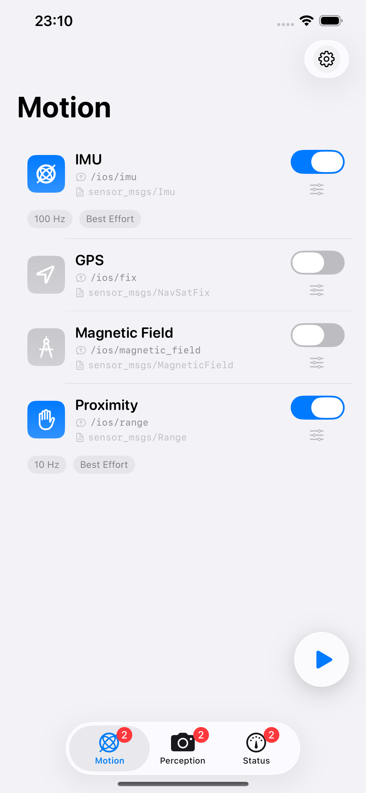
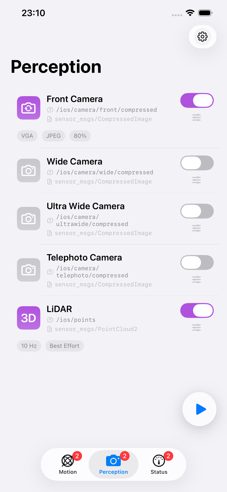
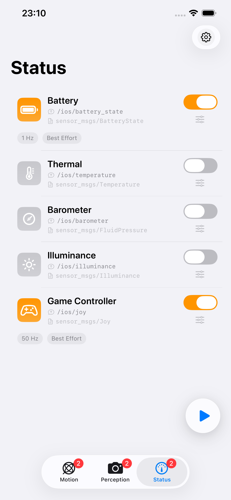
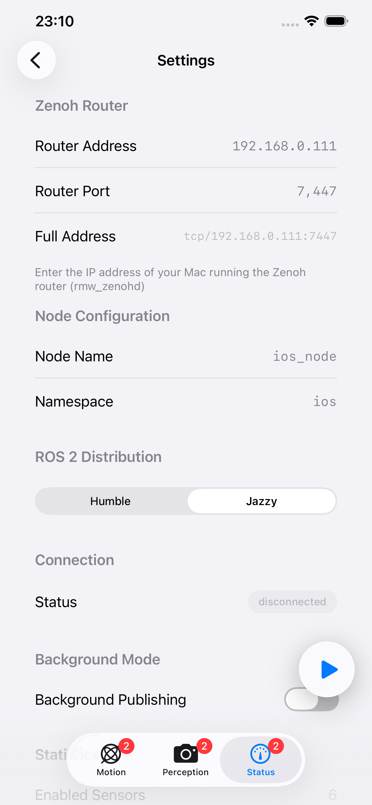
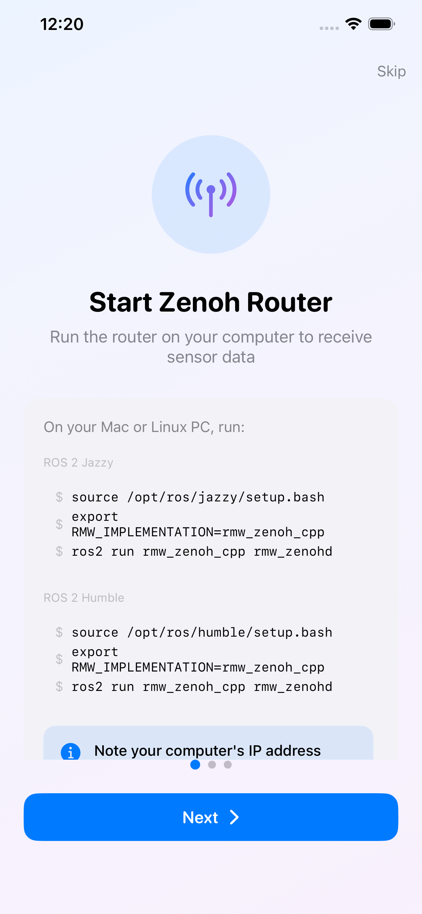
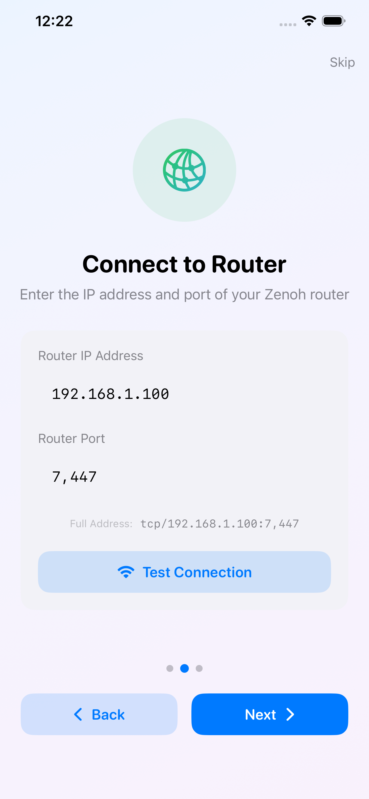
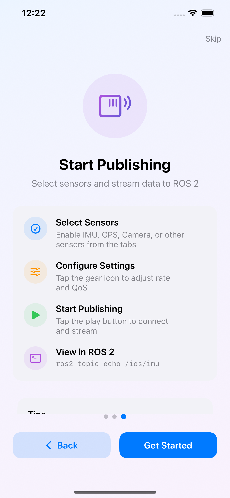

<div align="center">


# Conduit

**Transform your Apple devices into ROS 2 sensor publishers**

Stream real-time sensor data directly to your robotics system via Zenoh — no bridge required.

[](https://apps.apple.com/jp/app/conduit-powered-by-ros/id6757171237?l=en-US)
[](https://ros.org)

</div>

---

## Demo Videos

<table>
<tr>
<td align="center" width="33%">
<a href="https://www.youtube.com/watch?v=d28sQYQlpYY">
<br>
<b>Teleoperation</b>
</a><br>
<sub>Control robots using Game Controller sensor via ROS 2 joy messages</sub>
</td>
<td align="center" width="33%">
<a href="https://www.youtube.com/watch?v=ObnJOpGvpzI">
<br>
<b>Camera & LiDAR</b>
</a><br>
<sub>Stream iPhone camera images and LiDAR point clouds to ROS 2</sub>
</td>
<td align="center" width="33%">
<a href="https://www.youtube.com/watch?v=2myDfnNBuuk">
<br>
<b>Getting Started</b>
</a><br>
<sub>Step-by-step guide to connect Conduit with your ROS 2 system</sub>
</td>
</tr>
</table>

---

## Features

| Platform | Sensors |
|----------|---------|
| iOS/iPadOS 16+ | All 12 sensors |
| visionOS 1+ | Camera, IMU, Game Controller |
| macOS 13+ | Camera, Battery, Game Controller |

### 12 Sensor Types

**Motion**: IMU (100Hz) · Magnetometer (100Hz) · GPS (1Hz) · Proximity (10Hz)

**Perception**: Camera (15Hz) · LiDAR (10Hz)

**Environment**: Barometer (10Hz) · Illuminance (10Hz) · Temperature (1Hz)

**Input**: Game Controller (50Hz) · Microphone

**Status**: Battery (1Hz)

---

## Screenshots

### Sensor Tabs

<table>
<tr>
<td align="center" width="25%">
<br>
<b>Motion</b><br>
<sub>IMU, GPS, Magnetometer, Proximity</sub>
</td>
<td align="center" width="25%">
<br>
<b>Perception</b><br>
<sub>Camera, LiDAR</sub>
</td>
<td align="center" width="25%">
<br>
<b>Status</b><br>
<sub>Battery, Thermal, Barometer, etc.</sub>
</td>
<td align="center" width="25%">
<br>
<b>Settings</b><br>
<sub>Router, Node, ROS 2 Distribution</sub>
</td>
</tr>
</table>

### Getting Started

<table>
<tr>
<td align="center" width="25%">
<br>
<b>1. Start Zenoh Router</b><br>
<sub>Run rmw_zenohd on your ROS 2 system</sub>
</td>
<td align="center" width="25%">
<br>
<b>2. Connect to Router</b><br>
<sub>Enter IP address and port</sub>
</td>
<td align="center" width="25%">
<br>
<b>3. Start Publishing</b><br>
<sub>Select sensors and stream to ROS 2</sub>
</td>
<td width="25%"></td>
</tr>
</table>

---

## Quick Start

1. **Download** from [App Store](https://apps.apple.com/jp/app/conduit-powered-by-ros/id6757171237?l=en-US)
2. **Start Zenoh Router** on your ROS 2 system
3. **Configure** Router Address in Settings (e.g., `tcp/192.168.1.100:7447`)
4. **Enable** sensors you want to stream
5. **Tap Play** and verify with `ros2 topic echo /conduit/imu`

---

## Zenoh Router (Docker)

### Quick Start (Pre-built Image)

```bash
# ROS 2 Jazzy
docker run -d -p 7447:7447 --name ros_jazzy_zenoh ghcr.io/youtalk/conduit-support:jazzy

# ROS 2 Humble
docker run -d -p 7447:7447 --name ros_humble_zenoh ghcr.io/youtalk/conduit-support:humble
```

### Using Docker Compose

```bash
git clone https://github.com/youtalk/conduit-support.git
cd conduit-support/docker

# Start Jazzy router
docker compose up ros-jazzy -d

# Start Humble router
docker compose up ros-humble -d

# Stop
docker compose down
```

### Verify Connection

```bash
# Check topics
docker exec ros_jazzy_zenoh bash -c \
  "source /opt/ros/jazzy/setup.bash && ros2 topic list"

# Echo IMU data
docker exec ros_jazzy_zenoh bash -c \
  "source /opt/ros/jazzy/setup.bash && ros2 topic echo /conduit/imu"
```

### Configure Conduit App

1. Find your Mac's IP address: `ifconfig | grep inet`
2. In Conduit Settings, set Router Address to: `tcp/<YOUR_IP>:7447`
3. Tap Play to connect

---

## Documentation

- [FAQ](docs/FAQ.md) - Frequently asked questions
- [Troubleshooting Guide](docs/TROUBLESHOOTING.md) - Common issues and solutions
- [Platform Notes](docs/PLATFORM_NOTES.md) - Platform-specific information
- [Known Issues](docs/KNOWN_ISSUES.md) - Current limitations and workarounds

---

## Support

- [Report Bug / Request Feature](https://github.com/youtalk/conduit-support/issues/new/choose)
- [Community Discussions](https://github.com/youtalk/conduit-support/discussions)

---

## Links

- [App Website](https://www.youtalk.jp/conduit)
- [Source Code](https://github.com/youtalk/conduit)
- [Privacy Policy](https://www.youtalk.jp/conduit/#privacy-policy)
